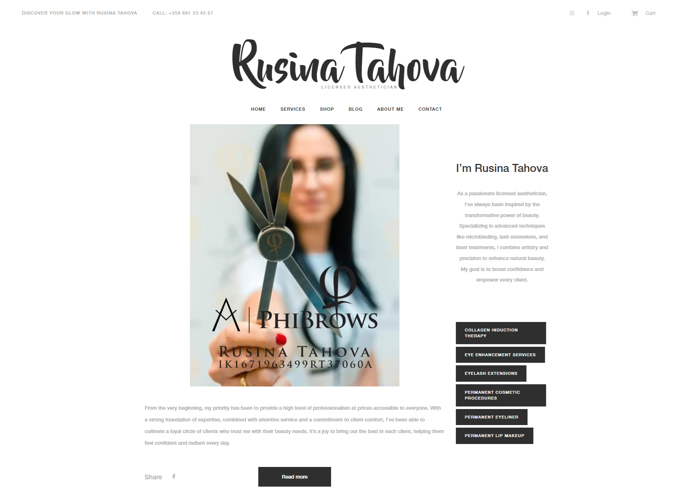
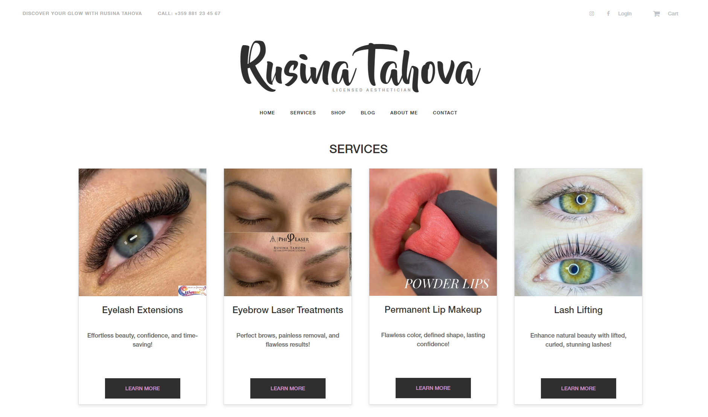
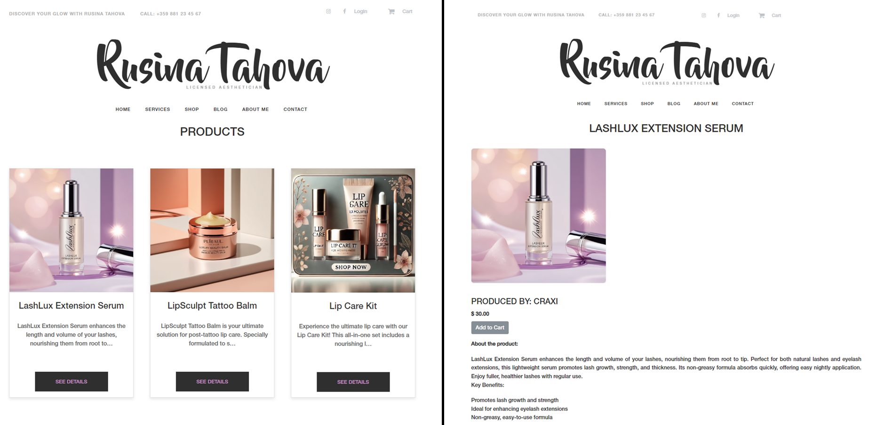
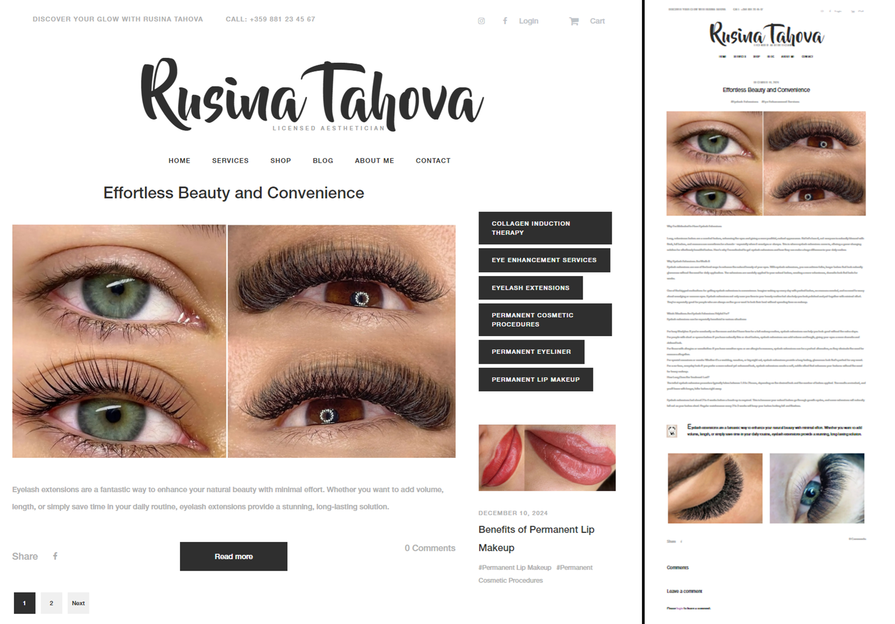
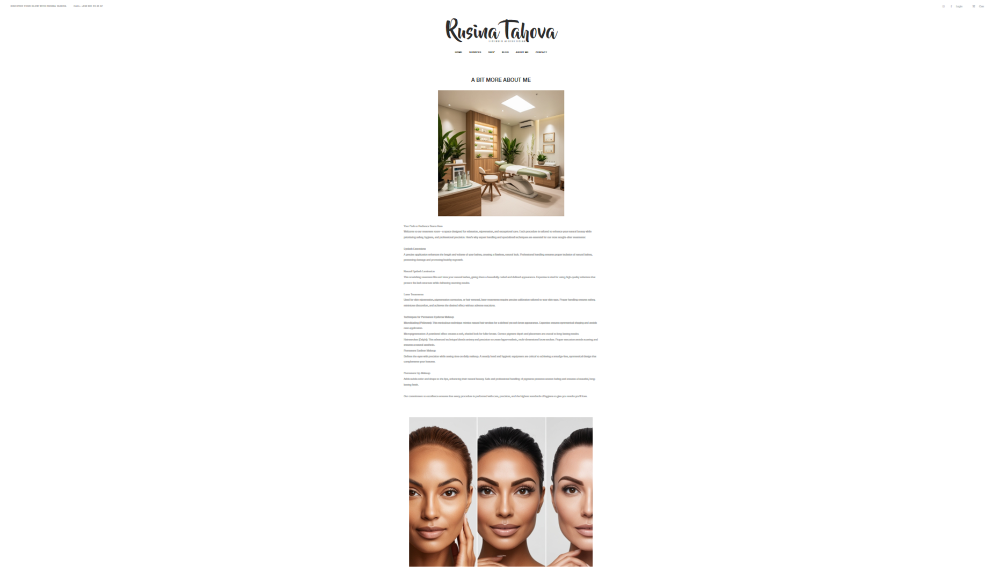
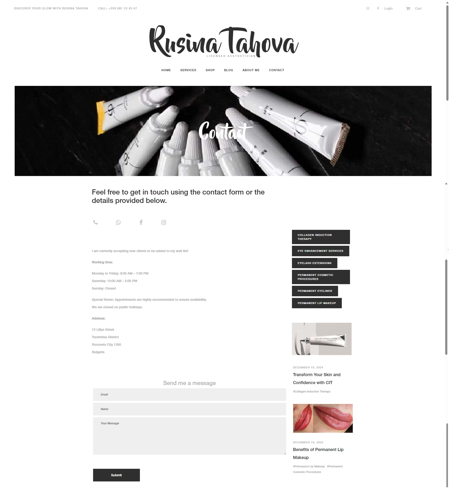
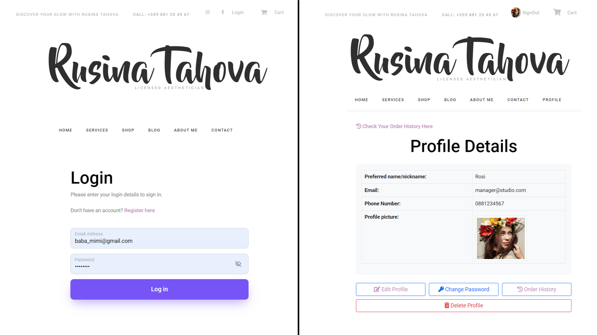
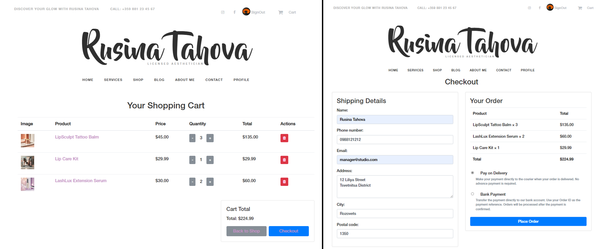

<h1><a href="https://drive.google.com/drive/folders/17Geu2jOGJmN8ll45nLMxd6rXXSbc4KYj?usp=sharing">This link is for easy set up and will be available for download from 11 Dec 2024 until 17 Dec 2024</a></h1>
<h1>My email: niklay.s.nikolov@gmail Tel: +359 887 240987</h1>
<h3> Try it here: https://studiocosmetic.azurewebsites.net </h3>

    
superuser: media@studio.com pass: 1123qWER

    
staff: staff@studio.com pass: 1123qWER

    
staff: blog_creator@studio.com pass: 1123qWER

    
staff: nail_specialist@studio.com pass: 1123qWER

    
regular user: baba_mimi@gmail.com pass: 1123qWER

<h4><link rel="stylesheet" href="docs/project_setup.md">
<a href="docs/project_setup.md"><i class="text-uppercase"><strong>Detailed instructions for Project Setup</strong></i></a>
</h4>
<h1>
     Cosmetic Studio
</h1>

    Cosmetic-Studio is a Django-based web application designed to serve as a digital platform for managing and organizing a cosmetic business. The application provides tools for customer engagement, team introduction, service offerings, product sales, blog updates, and user management.

<h2>Project Overview</h2>

    Cosmetic-Studio aims to streamline operations in a cosmetic business by offering an all-in-one platform for managing:

<ul>
    <li><strong>Team Introduction:</strong> Showcasing your team and their expertise.</li>
    <li><strong>Services:</strong> Detailed information about all offered services.</li>
    <li><strong>Online Shop:</strong> A functional e-commerce page for product sales.</li>
    <li><strong>Customer Interaction:</strong> Contact options, a blog for updates, and user account features.</li>
</ul>

<h2>Features</h2>

<h3>Pages and Functionalities</h3>

<ol>
    <li>
        <strong>Home Page</strong>
        <ul>
            <li>Introduces the team using page cards with pictures.</li>
            <li>A friendly and inviting design to help customers connect with your team.</li>
        </ul>
        

            
        

    </li>

    <li>
        <strong>Services Page</strong>
        <ul>
            <li>Lists all services offered by the studio.</li>
            <li>Each service card includes have a "Learn More" button that displays:
                <ul>
                    <li>Duration.</li>
                    <li>Detailed explanation.</li>
                    <li>Service price.</li>
                </ul>
            </li>
        </ul>
        

            
        

    </li>

    <li>
        <strong>Online Shop</strong>
        <ul>
            <li>Displays all available products.</li>
            <li>Each product card have a "See Details" button leading to a page with:                  
                <ul>
                    <li>Product ingredients.</li>
                    <li>Usage instructions.</li>
                    <li>Price.</li>
                    <li>Option to add the product to the cart.</li>
                </ul>
            </li>
        </ul>
        

            
        

    </li>

    <li>
        <strong>Blog Page</strong>
        <ul>            
            <li>Features posts about:</li>
            <ul>
                <li>New products.</li>
                <li>Services.</li>
                <li>Team members.</li>
                <li>Detailed and engaging blog content.</li>
            </ul>
        </ul>
        

            
        

    </li>

    <li>
        <strong>About Me Page</strong>
        <ul>
            <li>A dedicated page for the manager's biography and background.</li>
        </ul>
        

            
        

    </li>

    <li>
        <strong>Contacts Page</strong>
        <ul>
            <li>Lists all communication options:</li>
            <li>Social media links (e.g., Facebook, Instagram).</li>
            <li>Phone number.</li>
            <li>Working hours.</li>
            <li>Contact form for direct messaging.</li>
        </ul>
        

            
        

    </li>

    <li>
        <strong>Login and Profile Page</strong>
        <ul>
            <li>A Login page with register link</li>
            <li>For registered users, providing full account management:</li>
            <li>View, edit, and delete orders.</li>
            <li>Track orders by status (pending, processing, completed, canceled).</li>
            <li>Delete profile option.</li>
        </ul>
        

            
        

    </li>

    <li>
        <strong>Cart Page</strong>
        <ul>
            <li>Displays all selected products.</li>
            <li>Checkout functionality for placing orders.</li>
        </ul>
        

            
        

    </li>
</ol>