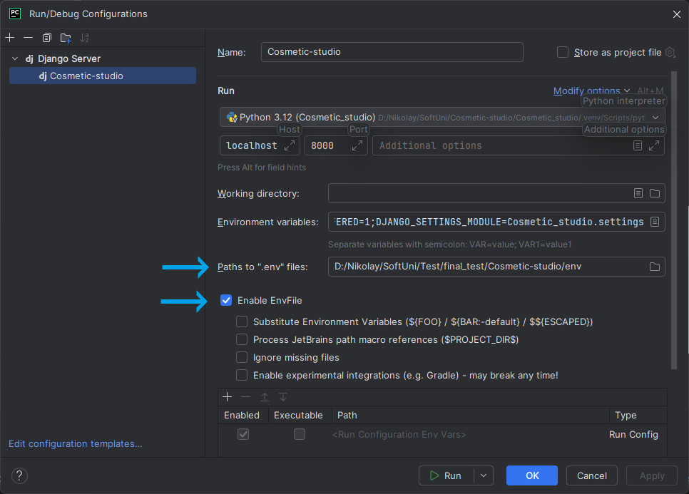

# Setup Instructions

## Prerequisites

To run this project, you will need:

- Python 3.10+
- Azure Blob Storage for serving the media files
- PostgreSQL or SQLite for the database.

## Setup Guide

### Step 1: Clone the Repository

First, clone the repository to your local machine:

```sh
git clone https://github.com/Nikolay-S-Nikolov/Cosmetic-studio.git
```

### Step 2: Configure Environment Variables

You need to set up the environment variables to run the project. 
A `.env_template` file is included in the repository to guide you.

1. Copy the `.env_template` file:
```sh
cp .env_template .env
```

2. Edit the `.env` file and fill in the required values, such as:
   - `SECRET_KEY`: A secret key for Django.
   - Database connection settings (`DB_NAME`, `DB_USER`, `DB_PASSWORD`, etc.).
   - `DEBUG`: Set to True for development, False for production.
   - `ALLOWED_HOSTS`: Add your allowed hosts, separated by commas.

### Step 3: Create the Virtual Environment:


```sh
python -m venv .venv
```

### Step 4: Activate the Virtual Environment:


```sh
.venv\Scripts\activate
```

### Step 5: If you are using PyCharm edit run/debug configurations to enable the .env file:
   - Click on Run > Edit Configurations from the top menu.
   - Select your configuration.
   - Set Enable EnvFile.
   - Fill the field 'Paths to ".env" files'.
   - Apply your configuration
   - 


### Step 6: Install Dependencies


```sh
pip install -r requirements.txt
```

### Step 7: Activate loading files from .env


```sh
pip install -r requirements.txt
```

### Step 8: Set Up the Database

Ensure `PostgreSQL` is running and set up your database using the credentials provided in the `.env `file.

Next, run the following commands to apply database migrations:
```sh
python manage.py migrate
```


### Step 9: Create a Superuser
To access the admin panel create a superuser account:

```sh
  python manage.py createsuperuser
```

Follow the prompts to set up the superuser credentials.

### Step 10: Run the Development Server
Run the server with the following command:

```sh
python manage.py runserver
```

By default, the server runs on http://127.0.0.1:8000/.


### Running Tests
Tests are located in the `tests/` directory.

To run the tests:
```shell
python manage.py test
```